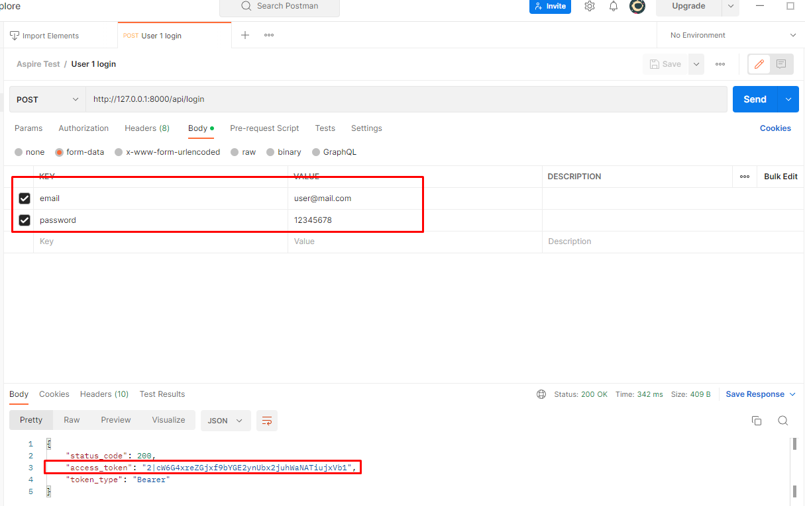

### SETUP
**MAKE SURE YOU HAVE COMPOSER, PHP AND ORDER DEV TOOL, DEV ENV**

#### ENV & DATA SETUP
- Open project, inside project run: **composer install**
- Run this command to bring the application up: **php artisan serve**
- Run command to create database (sqlite): **php artisan migrate**
- Run command to install demo user: **php artisan db:seed**

#### POSTMAN SETUP
- Head to folder **examples** in root directory and import the **Postman Collection**
- After that you will have a collection named **Aspire Test**

### **Now you ready to go!!!!**

### THE TEST API
**PLEASE MAKE SURE YOU TEST THE API WITH CORRECT ID IN DATABASE** 

- **User 1 login**, **User 2 login**, **Admin login** (POST) get token to login user account
  - body: **email, password**
  - after click to send button the application will response **access_token**, please copy it and use for every server request 
  
  

- **User create loan** (POST) to test user submit loan to application
  - body: **amount (int), term (int)**
- **User loans** (GET) to get the list of loan that belong to user
- **User show loan** (GET) simple to get the loan info
  - param: **/api/loan/{loan}** loan is a **loan_id** in table **loans**
- **Admin approve loan** (PUT) give admin the ability to approve the loan
    - param: **/api/loan/approve/{loan}** loan is a **loan_id** in table **loans**
- **User repayment** (PUT) for users to pay off their loans
  - body: **amount (int)**
  - param: **/api/repayment/{repayment}** repayment is a **scheduled_repayments_loan_id** in table **scheduled_repayments_loan**

### FEATURE TEST
- run the command:  **php artisan test**
- run the command for coverage: **php artisan test --coverage-html tests/reports/coverage**
- also review the test in **tests** folder

### ARCHITECTURE
**ENV**
- **php artisan serve and sqlite** good for demo project no need to set up too much
- **laravel sanctum** for authentication, it simple and easy to use in this case

**Design**
- **Services Layer (or Business Layer)** it is good for the business implementation of the application while increasing the reusability of the logic
- **Repository Layer** is an intermediate layer before accessing the database, it will increase the compatibility as well as the reusability or changeability of the database.
- **Shared** the folder include constant or something that share between layer
- **Request** just stand request validate of Laravel
- **Request Macro** normalize the response from the server side

**BUSINESS**
- User can submit their loan but it's pretty basic as they can't subscribe to the billing cycle so I added **payment_cycle**
- Users can only pay when admin has approved their loan
- I also add interest rates to make sure the lender is not disadvantaged!!!
- Amount of Payment will be equal to debt + interest
